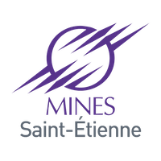

# ISMIN 2020

Homepage with links to all refs (slides and source code for the TPs) of Web Development and Android Development courses.

These courses are followed by students of Mines St Etienne, ISMIN - M2 Computer Science.      

# Web Development 

## Slides

 1. Web dev history: [link](https://docs.google.com/presentation/d/1G3NzexpajWE-8K_louukRLqgNoU7yIFUqiZ7g5rGV6A/edit?usp=sharing)
 2. TypeScript: [link](https://docs.google.com/presentation/d/18u-UrIIRkzURgRof3yRqo-v0uqOOY5ooE5bbkh7It6E/edit?usp=sharing)
 3. NestJS: [link](https://docs.google.com/presentation/d/16A2KWAtrzli1kY2_uALsbOGIJS8ZP-pPOhl_BZZ7Lag/edit?usp=sharing)

## TPs

### TP1: 📚 Introduction to TypeScript

See dedicated [repo](https://github.com/gaetanmaisse/ismin-web-2020-tp1).

### TP2: 🐈 Introduction to NestJS

See dedicated [repo](https://github.com/gaetanmaisse/ismin-web-2020-tp2).

### TP3: 🍃 NestJS - MongoDB storage

See dedicated [repo](https://github.com/gaetanmaisse/ismin-web-2020-tp3).

### TP4: 🚀 Deployment in the Cloud

See dedicated [repo](https://github.com/gaetanmaisse/ismin-web-2020-tp4).

# Android Development 

## Slides

Slides are available [here](https://docs.google.com/presentation/d/16A2KWAtrzli1kY2_uALsbOGIJS8ZP-pPOhl_BZZ7Lag/edit?usp=sharing).

## TPs

### TP1: 📚 Introduction to Kotlin

See dedicated [repo](https://github.com/gaetanmaisse/ismin-android-2020-tp1).

### TP2: 🖼 Android Basics: Activity + Layout System

See dedicated [repo](https://github.com/gaetanmaisse/ismin-android-2020-tp2).

### TP3: 

WIP

### TP4: 

WIP

# Project 

## Slides

Slides are available [here](https://docs.google.com/presentation/d/16A2KWAtrzli1kY2_uALsbOGIJS8ZP-pPOhl_BZZ7Lag/edit?usp=sharing).

## Template 

A template repo containing a NestJS API and an Android App is available [here](https://github.com/gaetanmaisse/ismin-2020-project). 
You can simply fork it and start coding!

